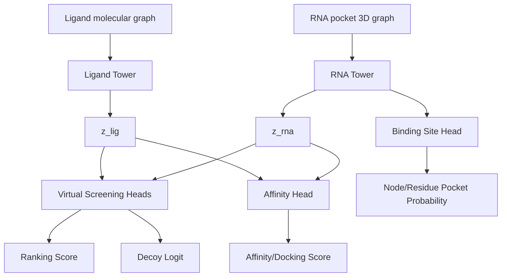

# RNA3D-CLFM 下游三任务说明（中文内部）

本文件专门回答三类下游任务：
- virtual screening
- binding-site prediction
- affinity prediction

## 1. 三任务统一视角

统一 backbone：
- RNA 3D tower
- ligand graph tower
- shared embedding space

任务分支：
1. Virtual screening: 排序 + decoy 分离
2. Binding-site: residue/node 概率预测
3. Affinity: 回归（可叠加排序）

## 2. 三任务流程图



## 3. 任务一：Virtual Screening

配置文件：
- configs/downstream_virtual_screening.yaml

训练重点：
- contrastive + ranking + decoy BCE
- decoy curriculum: 20 -> 50 -> 100

建议主指标：
- EF1%, EF2%, NDCG
- ROC-AUC, PR-AUC（active/decoy）

运行命令：
```bash
python scripts/train_unified_multitask.py --config configs/downstream_virtual_screening.yaml
```

## 4. 任务二：Binding-site Prediction

配置文件：
- configs/downstream_binding_site.yaml

训练重点：
- site BCE 为主
- ranking/decoy 作为弱正则（小权重）

建议主指标：
- node AUROC
- node AUPRC
- F1（固定阈值）

运行命令：
```bash
python scripts/train_unified_multitask.py --config configs/downstream_binding_site.yaml
```

## 5. 任务三：Affinity Prediction

配置文件：
- configs/downstream_affinity.yaml

训练重点：
- docking/affinity regression 为主
- ranking 为辅（提升相对次序）

建议主指标：
- RMSE
- MAE
- Pearson
- Spearman

运行命令：
```bash
python scripts/train_unified_multitask.py --config configs/downstream_affinity.yaml
```

## 6. 推荐执行顺序

1. 先跑 virtual screening（最能反映 decoy 策略价值）。
2. 再跑 affinity（看回归与排序一致性）。
3. 最后跑 binding-site（确认节点级可解释性不退化）。

## 7. 最小结果表（内部）

| Task | Config | Main Loss Focus | Main Metrics |
|---|---|---|---|
| Virtual Screening | downstream_virtual_screening.yaml | contrastive + ranking + decoy | EF1%, NDCG, ROC-AUC |
| Binding Site | downstream_binding_site.yaml | site BCE | node AUROC, AUPRC |
| Affinity | downstream_affinity.yaml | regression + ranking | RMSE, Pearson |

## 8. 注意事项

1. 统一使用 scaffold + family split 作为主报告。
2. 3 seeds 起步，记录 mean/std。
3. 每个任务都至少汇报一个和 full model 的消融对照。
