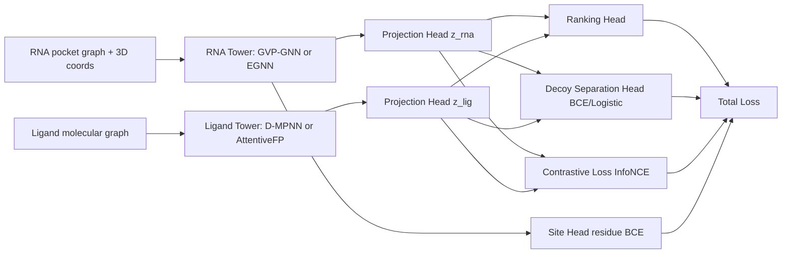

# RNA3D-CLFM 内部方案文档（中文）

本文档用于内部讨论，不对外发布。
目标是明确我们自己的建模路线：
- 不沿用固定 2.5D 表示
- RNA pocket 使用现代 3D 几何图编码器
- ligand 统一用分子图编码器
- 使用 two-tower 对比学习 + 排序 + decoy 分离目标

## 1. 目标与约束

核心目标：
1. 在严格 split 下提升 active/decoy 区分与排序能力。
2. 保留 residue-level binding-site 预测能力。
3. 架构可平滑扩展到后续 protein-RNA 场景。

工程约束：
1. 继续兼容当前 manifest 字段和数据准备脚本。
2. 先做可训练、可复现实验，再做重型模型升级。

## 2. 总体架构（Two-Tower）

- RNA Tower（Pocket 3D Encoder）
- Ligand Tower（Molecular Graph Encoder）
- Shared Embedding Space（投影头后进行对比学习）
- Task Heads（ranking / decoy score / optional affinity regression / site head）

### 2.1 思路图（Mermaid）

## 3. RNA Pocket Encoder 方案

推荐顺序：
1. GVP-GNN（首选）
- 显式建模 scalar/vector 通道，适合 3D 几何。
- 对 pocket 任务通常比纯拓扑图更稳。

2. EGNN（强备选）
- 实现相对简单，坐标更新机制清晰。
- 在中等规模数据上通常有较好性价比。

3. 更重型 SE(3)-aware 模型（后续）
- 表达力更强，但调参和算力成本更高。

输入建议：
- 节点：核苷酸类型、in_pocket、局部拓扑统计
- 几何：坐标、距离桶、可选方向特征
- 边：关系类型 + 距离桶

输出建议：
- node embedding: h_rna_node
- pooled embedding: z_rna

## 4. Ligand Encoder 方案

推荐顺序：
1. D-MPNN/MPNN（首选）
- 分子图任务成熟，工程风险低。

2. AttentiveFP 或 GIN/GATv2（消融）
- 用于验证是否存在明显结构收益。

3. Graph Transformer（后续）
- 配体多样性很高时可尝试，成本更高。

输入建议：
- RDKit atom/bond feature graph
- 可选附加 ECFP 分支用于融合

输出建议：
- node/edge aware graph embedding: z_lig

## 5. Loss 设计（你提到的 rank + decoy 远离）

建议总损失：

L_total = w_c * L_contrastive + w_r * L_rank + w_d * L_decoy + w_s * L_site (+ w_a * L_affinity)

其中：
1. L_contrastive
- In-batch multi-negative InfoNCE
- active pair 拉近，decoy 作为负样本推远

2. L_rank
- pocket 内 active > decoy
- 可选 margin ranking 或 listwise 排序

3. L_decoy
- active/decoy 二分类 BCE 或 pairwise logistic
- 直接约束 decoy separation score

4. L_site
- residue/node BCE，用于 binding-site 监督

5. L_affinity（可选）
- 对有 docking score 或回归标签的数据增加回归头

## 6. 训练流程（建议）

Stage A: 结构与对比预训练
- 数据：simulated graph + ligand decoy
- 目标：L_contrastive + L_decoy（可小权重 L_rank）

Stage B: 多任务 finetune（affinity）
- 数据：docking + binary + decoy
- 目标：L_contrastive + L_rank + L_decoy (+ L_affinity)

Stage C: site finetune
- 数据：pocket node labels
- 目标：L_site（可联合保留弱对比约束）

## 7. 关键实验设计（防 reviewer）

必须报告：
1. ligand scaffold split
2. RNA family/pocket split
3. scaffold + family hard split
4. decoy 数量 20/50/100 三组
5. 至少 3 seeds 的均值和方差

必须消融：
1. GVP vs EGNN
2. D-MPNN vs AttentiveFP
3. contrastive only vs contrastive+rank vs full loss
4. decoy hardness curriculum 的增益

## 8. 第一版可落地配置（建议）

优先落地组合：
1. RNA Tower: GVP-GNN
2. Ligand Tower: D-MPNN
3. Heads: contrastive + ranking + decoy + site
4. Decoy: 20 -> 50 -> 100 逐步增难
5. Split: scaffold + family 作为主结果表

这样做的优点：
- 和你提出的方向完全一致
- 不再绑定旧 2.5D 表示
- 实验路径清晰，方便快速迭代和投稿准备
